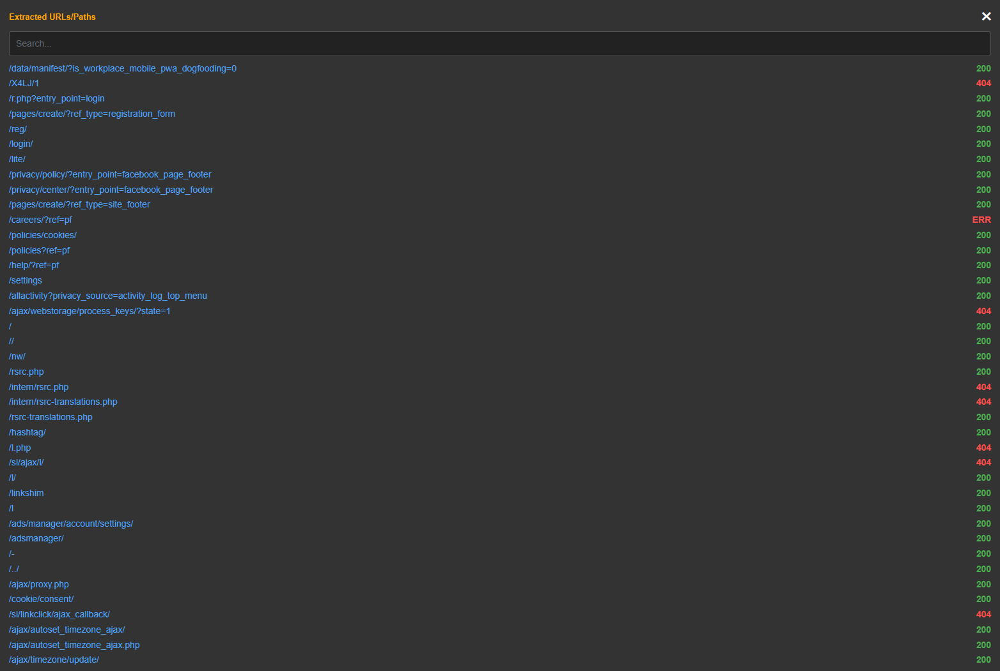

# JS-endpoint-extractor
bookmark for javascript endpoint extractor

- add new bookmark 
- in the url paste the minified script

once it done just click the bookmark on website and the js endpoint will be extracted 

